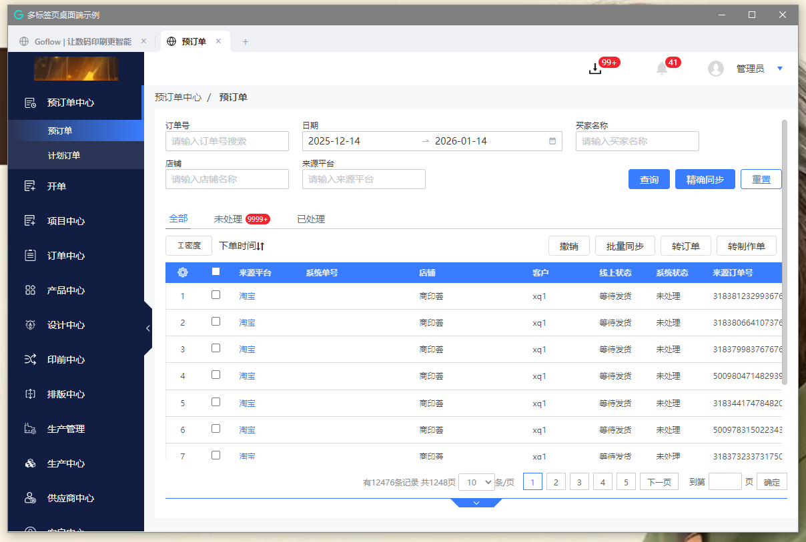

# Electron Tab Containers

这是一个基于 Electron、TypeScript 和 Vite 构建的多标签页、多容器应用程序示例。它演示了如何使用 `BrowserView` 来实现高性能、隔离的标签页浏览体验。



## ✨ 特性

- **多标签页支持**：支持创建、关闭和切换标签页，体验类似现代浏览器。
- **容器隔离**：每个标签页都在独立的 `GDWebContainer` (封装了 `BrowserView`) 中运行，确保页面间的互不干扰。
- **实时标题同步**：标签页标题会根据加载网页的标题实时更新。
- **自动隐藏菜单栏**：默认隐藏 Electron 的顶部菜单栏，提供更沉浸的视觉体验。
- **IPC 通信机制**：内置 `GNBEventBus` 和 `DesktopService`，实现主进程与渲染进程间的高效通信。
- **现代化技术栈**：使用 TypeScript 进行类型安全开发，Vite 提升构建和开发速度。

## 🛠️ 技术栈

- **Electron**: 桌面应用框架 (v27)
- **TypeScript**: 静态类型语言
- **Vite**: 前端构建工具
- **Electron Forge**: 打包和发布工具

## 📂 项目结构

```
d:\project\electron-tab-containers
├── src/                # 主进程代码
│   ├── container/      # 容器逻辑 (GDWebContainer)
│   ├── pages/          # 页面/标签页管理 (GDTabPageContainer)
│   ├── service/        # IPC 服务 (DesktopService)
│   ├── window/         # 窗口创建逻辑
│   ├── helpers/        # 工具函数 (EventBus, WebHelpers)
│   └── main.ts         # 主进程入口
├── render/             # 渲染进程代码 (UI)
│   ├── tabs/           # 标签页 UI 组件
│   ├── utils/          # UI 事件管理
│   └── main.ts         # 渲染进程入口
├── dist/               # 构建输出目录
└── package.json        # 项目配置
```

## 🚀 快速开始

### 环境要求

- Node.js (建议 v16+)
- npm 或 yarn

### 安装依赖

```bash
npm install
```

### 开发模式

同时启动渲染进程（Vite）和主进程（Electron）：

```bash
npm run dev
```

### 构建打包

构建生产环境版本：

```bash
# 仅打包
npm run package

# 打包并生成安装程序
npm run make
```

## 📝 核心实现细节

### 容器化 (Containerization)

项目核心在于 `src/container/container.ts` 中的 `GDWebContainer` 类。它封装了 Electron 的 `BrowserView`，为每个标签页提供独立的渲染上下文。

### 标签页管理

`GDTabPageContainer` (位于 `src/pages`) 负责管理所有的容器实例，处理标签页的创建、销毁和切换逻辑。

### 进程间通信

项目使用自定义的 `DesktopService` 和 `functionMap` 模式来处理渲染进程发出的 IPC 请求，使得前后端交互逻辑清晰可维护。

## 📄 许可证

MIT License
